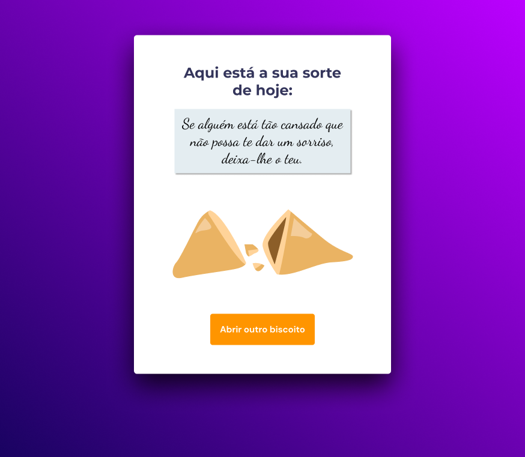

<h1 align="center"> Jogo da adivinhação </h1>

 

  <a href="#-tecnologias">Tecnologias</a>&nbsp;&nbsp;&nbsp;|&nbsp;&nbsp;&nbsp;
  <a href="#-descrição">Descrição</a>&nbsp;&nbsp;&nbsp;|&nbsp;&nbsp;&nbsp;
  <a href="#-confira-o-projeto">Confira o projeto</a>&nbsp;&nbsp;&nbsp;

  

## 🚀 Tecnologias

Esse projeto foi desenvolvido com as seguintes tecnologias:

- HTML
- CSS
- JavaScript
- Figma
- Git e Github

---

 

## 💻 Descrição

Projeto simples de um programa que apresenta uma mensagem positiva para o usuário, tendo as funcionalidades:

- O usuário clica no biscoito, abrindo-o e recebendo uma mensagem positiva
- O usuário pode abrir outro biscoito através do botão em tela

 

### 🔑 Acesse o projeto!

[Biscoito da sorte](https://eduvieira131.github.io/Biscoito-da-sorte/)

---

## Confira o projeto:

  Uma pequena amostra sobre o que esperar do projeto!

 

  

